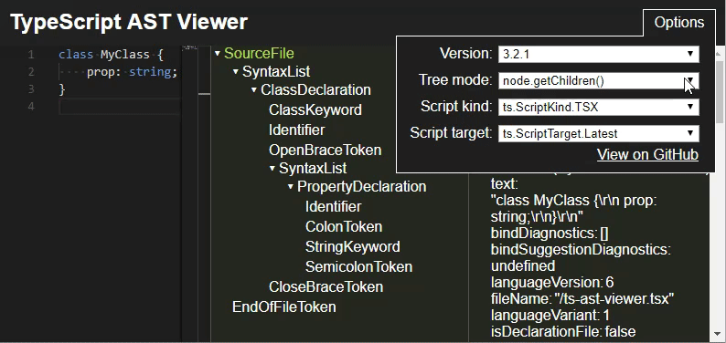

## Navigating the AST

Navigating the AST should be simple and straightforward.

Right now, the best way to explore what's implemented is to look at the autocompletion/intellisense results
or view [this report](https://github.com/dsherret/ts-morph/blob/master/wrapped-nodes.md).

If you can't find something that means it's most likely not implemented and you should [open an issue](https://github.com/dsherret/ts-morph/issues) on GitHub.

### General methods

Search autocomplete for methods like `.getChildren()`, `.getParent()`, `.getFirstChildBySyntaxKind(kind)`, etc...

Many exist. If you find one you would really like, then please [open an issue](https://github.com/dsherret/ts-morph/issues).

### `getChildren()` and `forEachChild(child => ...)`

In general, you can easily navigate the tree by using methods such as `.getClasses()`, `.getClass('MyClass')`, `.getNamespaces()`, and so on, but in some cases you might want to get all the child nodes.

In the compiler API, there exists a `node.getChildren()` method and `ts.forEachChild(node, child => { })`/`node.forEachChild(child => { })` function/method.

* `.getChildren()` - Returns all the children including the all the tokens (ex. `OpenBraceToken`, `SemiColonToken` etc.).
* `.forEachChild(child => {})` - Iterates all the child nodes that are properties of the node.

[](http://ts-ast-viewer.com)

In ts-morph, these methods also exist and they can be used similarly to the compiler API:

```ts
const allChildren = node.getChildren();

node.forEachChild(node => {
    console.log(node.getText());
});

const classDec = node.forEachChild(node => {
    if (TypeGuards.isClassDeclaration(node))
        return node; // stops iterating over the children and returns this value
    return undefined; // return a falsy value or no value to continue iterating
});
```

### `forEachDescendant`

If you wish to iterate all the descendants, then use the `forEachDescendant` method:

```ts
node.forEachDescendant(node => console.log(node.getText()));
```

This is especially useful when writing code that implements a visitor pattern:

```ts ignore-error: 1109, setup: let sourceFiles: SourceFile[];
interface Visitor {
    visit(node: Node): void;
}

const myVisitors: Visitor[] = ...;

for (const sourceFile of sourceFiles)
    sourceFile.forEachDescendant(node => myVisitors.forEach(v => v.visit(node)));
```

#### Traversal Control

Traversal can be controlled with the second parameter:

```ts
const result = node.forEachDescendant((node, traversal) => {
    switch (node.getKind()) {
        case SyntaxKind.ClassDeclaration:
            // skips traversal of the current node's descendants
            traversal.skip();
            break;
        case SyntaxKind.Parameter:
            // skips traversal of the current node's descendants and its siblings and all their descendants
            traversal.up();
            break;
        case SyntaxKind.FunctionDeclaration:
            // stops traversal completely
            traversal.stop();
            break;
        case SyntaxKind.InterfaceDeclaration:
            // stops traversal completely and returns this value
            return node;
    }

    return undefined;
});
```
